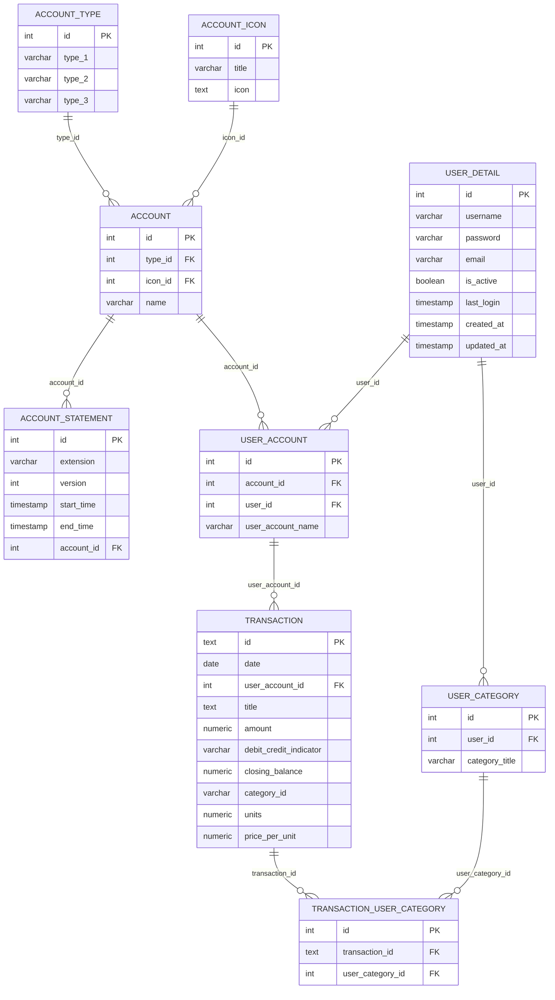

# Entity-relationship diagram

The shared `finance_manager` Postgres schema, as defined in [`dbscripts/table/create/*.sql`](../../dbscripts/README.md).

## Diagram

## Notes

- Table/column names and types are taken directly from `dbscripts/table/create/*.sql`; dependency order (`account_icon`/`account_type` -> `account` -> `account_statement`/`user_detail` -> `user_account` -> `transaction` -> `user_category` -> `transaction_user_category`) matches `dbscripts/script/setup.list` and the order documented in the root `CLAUDE.md`.
- `transaction.category_id` (a plain `varchar(200)`) is a separate, unenforced column from the `transaction_user_category` join table below it - the join table is the actual categorization mechanism used by `transaction-service`'s `/category/v1/transaction_user_category/edit_all`; `category_id` is not modeled as a foreign key here since the schema itself doesn't enforce it as one.
- `transaction.units`/`price_per_unit` are only populated for mutual-fund/broker statements (e.g. Groww) - bank-savings transactions leave them null and use `amount`/`closing_balance` instead.
- Ownership: `account`, `account_type`, `account_icon`, `user_account` belong to `account-service`; `transaction`, `user_category`, `transaction_user_category` belong to `transaction-service`; `user_detail` belongs to `api-gateway`; `account_statement` is read directly by `statement-loader` (no owning service API) - see the [high-level design](../hld/README.md).

## Kept in sync with

This diagram is derived from, and should be regenerated against, `dbscripts/table/create/*.sql` directly - not hand-maintained independently of the actual schema.
</content>
