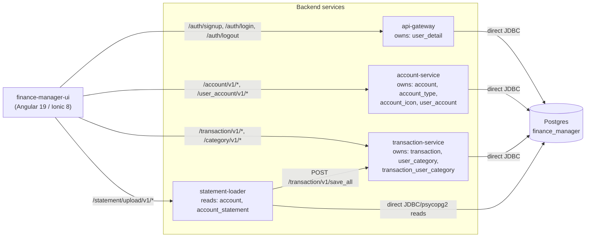

# High-level design

Every finance-manager service, the shared database, and who calls/owns what.

## Diagram

## Legend / how to read this

- **`finance-manager-ui`** is configured with all four backend base URLs simultaneously (`src/environments/environment*.ts`) and calls each service directly - there is no API-gateway-as-reverse-proxy layer.
- **`api-gateway`**, despite its name, only handles signup/login/logout (`/auth/*`). It reads/writes `user_detail` directly via JDBC and does **not** call any other backend service.
- **`account-service`** and **`transaction-service`** each own their own tables and are not called by each other, by `api-gateway`, or by `statement-loader` over HTTP - except the one edge below.
- **`statement-loader`** is the only module that both reads Postgres directly (`account`, `account_statement` metadata, to resolve which `StatementReader` parses an upload) **and** calls another service over HTTP: it POSTs parsed transactions to `transaction-service`'s `/transaction/v1/save_all` rather than writing `transaction` rows itself.
- No service other than the one that owns a table writes to it directly - all cross-cutting writes happen through the owning service's HTTP API (statement-loader -> transaction-service) or the UI calling the owning service directly.

## Kept in sync with

This diagram is derived from, and should be regenerated against, the root `CLAUDE.md`'s "Architecture" and "Service responsibilities" sections and each module's own README `Overview`/`Endpoints` sections - not hand-maintained independently of them.
