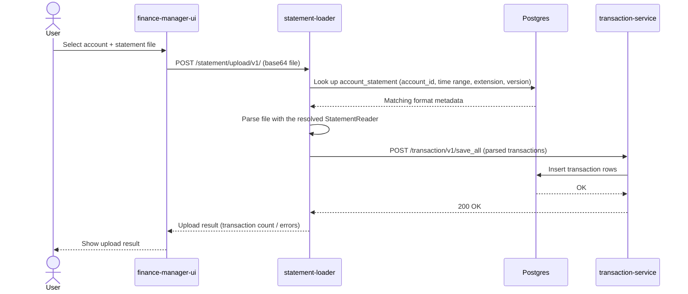
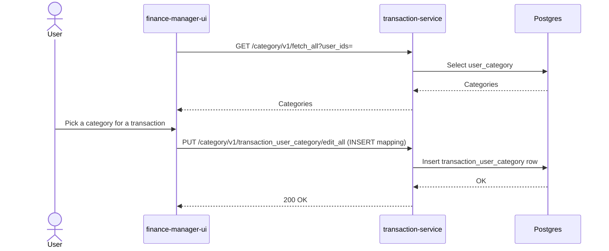
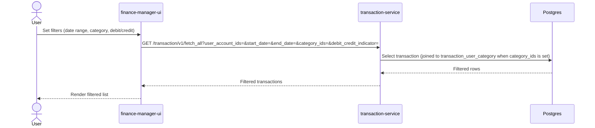
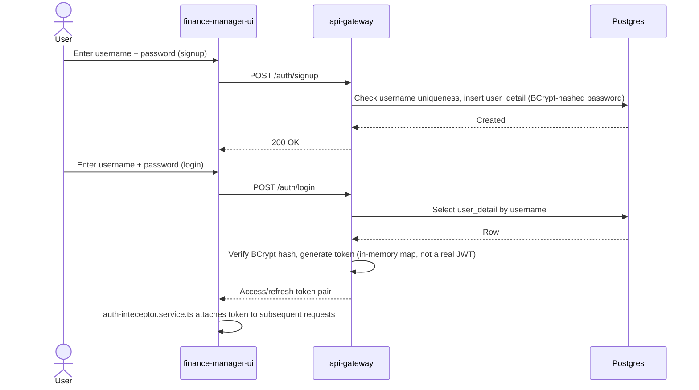

# Sequence diagrams

Step-by-step flow for finance-manager's key UI-driven actions. Each diagram covers one business-level action a user takes in `finance-manager-ui`, across whichever services/database it actually touches - see the [high-level design](../hld/README.md) for the static picture these flows move through.

## Upload a statement

Uploading a bank/broker statement file, parsing it, and persisting the resulting transactions.

## Categorize a transaction

Mapping an uploaded transaction to a user-defined category.

## Filter transactions

Fetching a user's transactions filtered by category and/or debit/credit indicator.

## Signup / login

`api-gateway`'s own auth flow - distinct from the other three flows because it's the one path that touches `user_detail` instead of the account/transaction domain.

## Kept in sync with

Each diagram is derived from, and should be regenerated against, the relevant module's `Endpoints` table and `Overview`/`Gotchas` sections (`statement-loader`, `transaction-service`, `api-gateway` READMEs) plus `finance-manager-ui`'s `src/service/*.service.ts` clients - not hand-maintained independently of them.
</content>
