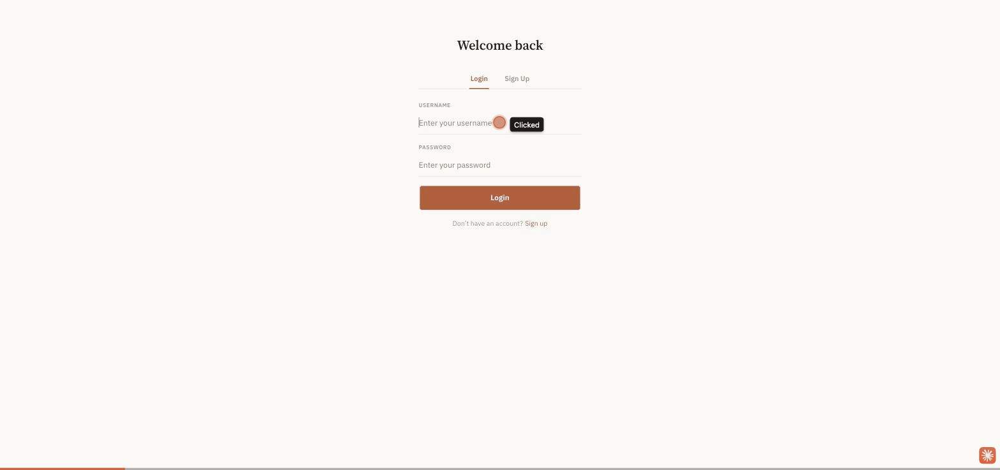
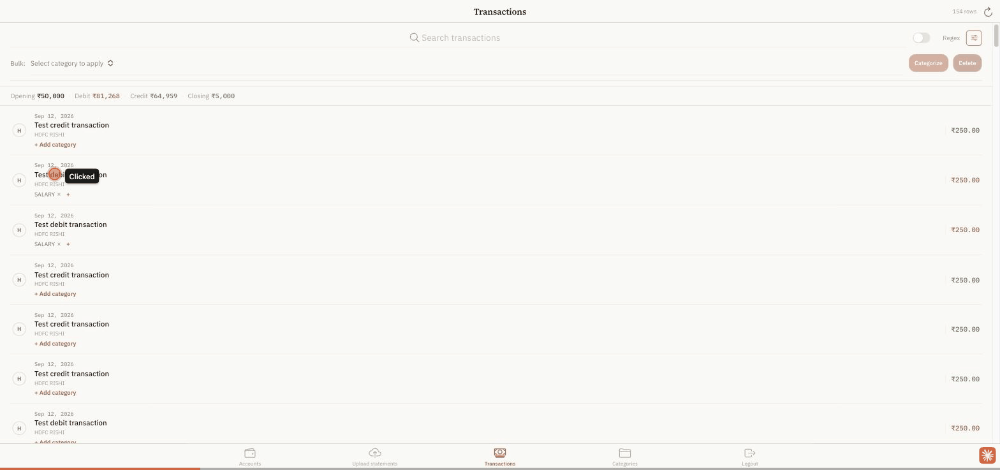
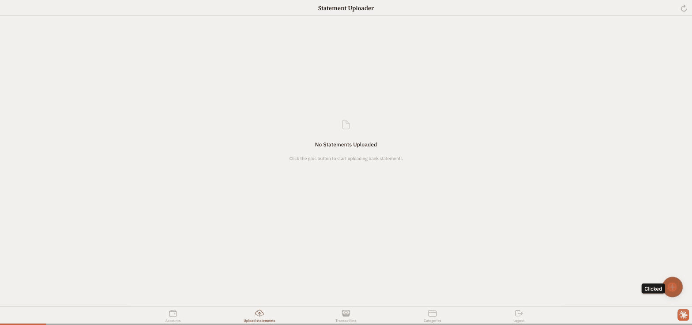
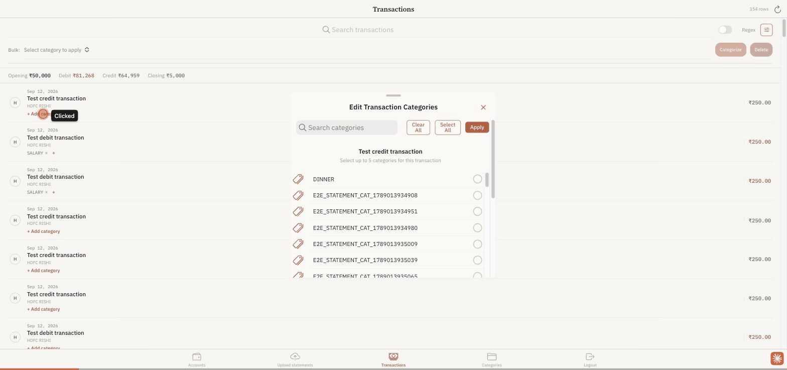
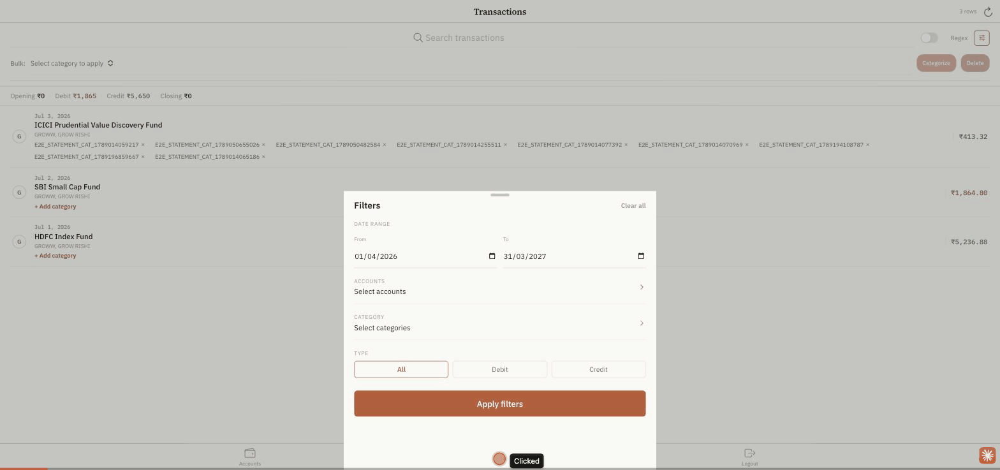
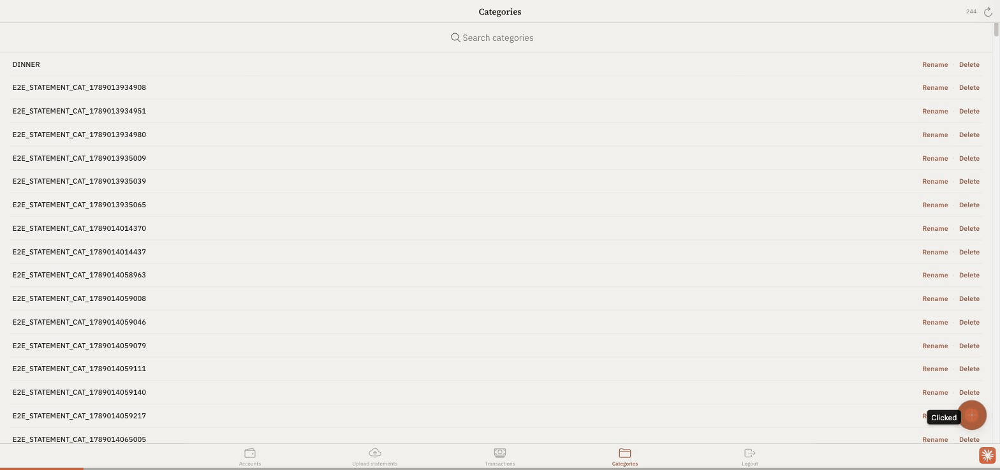
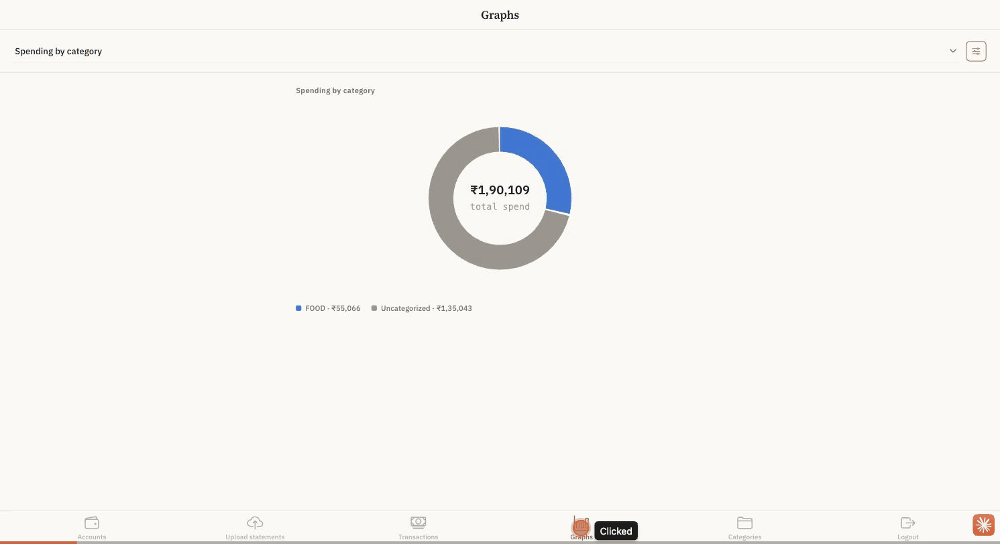

# Feature GIFs

A short animated GIF walkthrough of each app feature, recorded via the `feature-gif-capture` Claude Code skill (`.claude/skills/feature-gif-capture/SKILL.md`) against the running app with sample/demo data. Linked from the root [`README.md`](../README.md)'s features table. Unlike `ux/proof/`'s before/after comparisons (scoped to `jira/JIRA_12.md`), these GIFs are meant to stay current going forward - re-run the skill for a single feature whenever it changes, without touching the others.

## Login

Entering the demo credentials and landing on the account list.

## Accounts

The linked-accounts list, grouped by type (investment, credit, cash), with net worth.

## Upload a statement

Selecting an account, uploading a **synthetic** sample statement file (generated by `scripts/generate_dummy_statement_fixtures.py` - never a real personal statement), and the success state.

## Transactions

The transaction list for an account, including categorizing a transaction.

## Search & filter transactions

Opening the filter modal (date range, accounts, category, debit/credit type) and applying a filter to narrow the list.

## Categories

Adding a new category and finding it via search.

## Graphs

Widening the date filter via the Filters sheet, then switching the graph-type dropdown between spending by category, income vs. expense over time, monthly spending trend, and balance trend over time - including a hover tooltip on the category donut.
